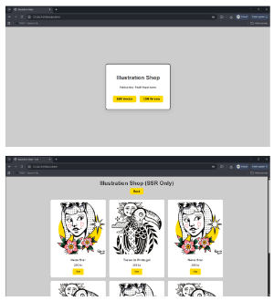

<h1 style="color:#FEDA01;"> Project 1, Client-Side vs Server-Side Rendering </h1>

## Assignment: course5 - JavaScript fundamentals
Hyper Island - FED27

Patricia Gea H Rodrigues - Individual project 

Illustration Shop. 
This project shows the difference between **Server-Side Rendering (SSR)** and **Client-Side Rendering (CSR)** using only HTML, CSS, and JavaScript.

## Project structure
- index.html → start page HTML 
- ssr.html → page with content already in HTML (SSR)
- csr.html → page that uses JS to render the content (CSR)
- style.css → shared styles for both pages
- script.js → JavaScript file to create the CSR content

## Demo Version
-

## How to run
1. Clone the repository.
2. Open `index.html` in your browser 

OBS⚠️ The CSR page depends on JavaScript. If JS is disabled, the content will not appear.

## Tech Stack
- HTML5, CSS3
- JavaScript 

## Features
- Browse illustrations in a grid layout
- Hover over thumbnails to preview larger images
- Click thumbnails to open full image
- Responsive design for desktop and mobile

## Future Improvements
- Add shopping cart functionality
- Add search/filter by illustration
- Add animations for hover popup
  
  

<h1 style="color:#FEDA01;">
SSR vs CSR = Comparison
</h1>

## Performance

- **SSR:** Content appears immediately because it is already in the HTML.
- **CSR:** Content only appears after JavaScript runs. It may take a few seconds on a slow connection.

## SEO
- **SSR:** Search engines can read the content immediately. Better for indexing.
- **CSR:** Search engines take longer or may not read all content if JavaScript does not run properly.

## User Experience
- **SSR:** The user never sees a blank screen. Works even if JavaScript is disabled. feels faster and eficient page.
- **CSR:** may the user feel it is as slow app because can take few seconds to load, a blank screen may appear before JavaScript runs. Depends on browser speed.

## Conclusion
- **SSR:** Ideal for public content, fast loading, and good for search engines, as landing page, first page.
- **CSR:** Ideal for interactive applications and dynamic content as dashboards, admin page, login page.

