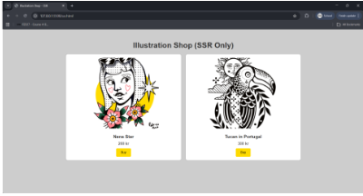

## Assignment: Project 1, Client-Side vs Server-Side Rendering

Hyper Island - FED27 - couse5 - JavaScript fundamentals

Patricia Gea H Rodrigues - Individual project 

Illustration Shop. 
This project shows the difference between **Server-Side Rendering (SSR)** and **Client-Side Rendering (CSR)** using only HTML, CSS, and JavaScript.

## Project structure
- ssr.html → page with content already in HTML (SSR)
- csr.html → page that uses JS to render the content (CSR)
- style.css → shared styles for both pages
- script.js → JavaScript file to create the CSR content

## How to run
1. Clone the repository.
2. Open `ssr.html` in your browser to see the **SSR version**.
3. Open `csr.html` in your browser to see the **CSR version**.

OBS⚠️ The CSR page depends on JavaScript. If JS is disabled, the content will not appear.

## Tech Stack
- HTML5, CSS3
- CSS Grid & Flexbox
- JavaScript (for modal popup)

## Features
- Browse illustrations in a grid layout
- Hover over thumbnails to preview larger images
- Click thumbnails to open full image
- Responsive design for desktop and mobile

## Future Improvements
- Add shopping cart functionality
- Add search/filter by illustration
- Add animations for hover popup

## Notes
You can find my comparison analysis in the file `comparison.md`.
